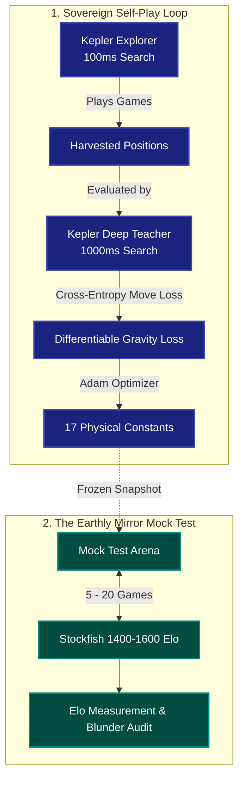

# Chapter 16: The Alien Physics Fallacy
### *Why Newtonian Gravity Refused to Copy Stockfish*

> *"You cannot teach an eagle to swim by punishing it every time it flaps its wings instead of using fins. If you want a universe governed by gravity to play chess, it must discover its own path to victory."*

---

## 1. The Great Temptation

In early iterations of Kepler-64, the engine was trained exclusively on **self-play bootstrapping**:
* An "explorer" universe played moves with shallow search and mild exploration noise.
* A "teacher" universe — running the exact same gravitational laws, but with a deeper search budget — evaluated the position and labeled the superior orbit.
* Gradient descent through JAX updated the 17 physical constants ($G, c, \eta_{\text{crit}}, \gamma, \dots$) so the shallow field learned to anticipate the deep field.

On a 162-game match against its frozen, hand-set baseline, the self-play universe achieved a staggering result:
**161 wins, 1 loss, 0 draws (99.38% win rate).**

The physics worked. But it raised an inevitable, seductive question:
> *If Kepler-64 is only learning from its own shallow self, isn't it stuck in an amateur echo chamber? What if we replace the teacher with Stockfish calibrated at 1600 Elo? Wouldn't that instantly lift the universe to master-level chess?*

On September 4, 2026, we ran that experiment on a cloud Tesla T4 GPU. 

The results were catastrophic — and scientifically brilliant.

---

## 2. The Experiment

We hooked Stockfish into the harvest loop via python-chess:
```python
engine.configure({"UCI_LimitStrength": True, "UCI_Elo": 1600})
```

* **Dataset:** 40 games harvested, 990 positions labeled by Stockfish 1600.
* **Optimization:** 800 steps of Adam through the full differentiable gravity kernel.
* **Validation:** On next-move imitation, capture MRR jumped from 0.447 to 0.654 (+0.207). On paper, the model appeared to be learning Stockfish's moves.

Then, we unleashed the trained universe onto the board in a 200-game match against the frozen baseline.

The result was an unmitigated disaster:
* **Wins:** 47
* **Losses:** 73
* **Draws:** 80
* **Elo proxy:** **-45** *(It played significantly worse than the unlearned baseline!)*
* **Vs Stockfish 1500:** **0 wins, 0 draws, 20 losses.**

---

## 3. The Autopsy: The Universe Rebels

Why did an engine that won 161–1 under self-play collapse to 47–73 when trained on a grandmaster engine?

The answer lay in the autopsy of the 17 physical constants:

| Constant | Symbol | Hand-Set Base | Trained on Stockfish | Physical Meaning |
|---|---|---|---|---|
| **Softening Radius** | $\epsilon$ | $0.500$ | **$2.517$** | Blunted by 500%! Gravity smoothed into a blur. |
| **Material Weight** | $M_{\text{gain}}$ | $2.000$ | **$0.939$** | Cut in half! The engine stopped valuing pieces. |
| **Position Deltas** | $\lambda_\Delta$ | $2.000$ | **$0.000$** | Tactical move sensitivity was completely shut off. |
| **Center of Mass** | $C_{\text{gain}}$ | $1.000$ | **$0.000$** | Positional momentum was completely shut off. |
| **Tidal Drift** | $\lambda_{\text{drift}}$ | $1.000$ | **$0.000$** | Verlet predictive horizon was completely shut off. |
| **Field Entropy** | $S_{\text{gain}}$ | $4.000$ | **$10.000$** | Slapped against the absolute maximum allowable clamp. |

### The Mathematical Trap
Stockfish does not play chess using gravitational fields. It plays chess using 15-ply search trees, pawn structure tables, and NNUE neural weights. It picks moves based on long-range tactical calculations that have no Newtonian analogue at depth 0.

When we forced a 17-parameter gravitational equation to rank Stockfish's moves higher than natural alternatives, the optimizer faced a mathematical impossibility: **a Newtonian gravitational equation cannot emulate a 15-ply alpha-beta search tree.**

To minimize the loss function, the optimizer did what gradient descent always does: it found the path of least mathematical resistance.
1. It **smoothed out the gravitational field** ($\epsilon \to 2.52$), eliminating sharp localized forces so conflicting tactical tensions disappeared.
2. It **diluted the material term** ($M_{\text{gain}} \to 0.94$), making piece losses look less severe.
3. It **killed all dynamic sensitivity terms** ($\lambda_\Delta, \lambda_{\text{drift}}, C_{\text{gain}} \to 0$).
4. It dumped all remaining unexplained variance into **entropy** ($10.0$).

The result was an engine that was **tactically numb**. It couldn't feel local threats. It didn't mind sacrificing pieces for vague positional delusions. When placed in combat against the frozen baseline — which still had sharp localized gravity ($\epsilon=0.5$) and strong material self-preservation ($M_{\text{gain}}=2.0$) — the trained universe was torn apart.

---

## 4. The Principle: Sovereign Physics, Earthly Mirror

This experiment yielded one of the most critical foundational laws of Kepler-64:

> **The Alien Physics Fallacy:**  
> *A physical system cannot be trained by direct behavioural cloning of a non-physical intelligence. Doing so forces the physical constants to degenerate in an attempt to mimic heuristics they have no capacity to express.*

Just as AlphaZero refused to learn from human databases or Stockfish evaluations, Kepler-64 must learn **from its own dynamics**:

1. **The Sovereign Engine (Self-Play Bootstrapping):**
   Kepler-64 must train on self-play bootstrapping. A shallow universe learning from a deep universe preserves physical invariants: gravity remains sharp, material remains precious, and tidal disruption remains lethal.
2. **The Earthly Mirror (The Sparring Partner):**
   Stockfish is not the teacher; **Stockfish is the auditor.**
   After each generation of self-play learning, Kepler-64 plays benchmark games against Stockfish (1200, 1400, 1600 Elo). This provides an objective, external measurement of its playing strength without allowing Stockfish's alien heuristics to contaminate the laws of physics.

---

## 5. The Self-Play Paradox & The Mock Test Protocol

A natural question arises whenever an engine learns purely from itself:
> *"If the system only learns from itself, we have no idea where it is going. It could discover a totally new way to play, or it could drift into an alien delusion where both players agree on bizarre moves that fail instantly in the real world. How do we keep it grounded without diluting its originality?"*

In reinforcement learning, this is known as **policy drift** or **non-transitive cyclic dynamics** (A beats B, B beats C, C beats A, but none play competent chess). If two identical universes play against each other, they can evolve mutual blind spots.

To solve this without contaminating the gradient descent, Kepler-64 establishes the **Mock Test Architecture**:



### How the Mock Test Works:
1. **Zero Gradient Contamination:** The mock test occurs *strictly after* training. Stockfish never writes to the loss function, never touches JAX gradients, and never dictates parameter updates.
2. **Standardized Calibration:** Playing 10–20 games against calibrated Stockfish (1400, 1500, 1600 Elo) provides an objective benchmark of tactical soundness. If self-play develops a degenerate opening or tactical blindness, the mock test catches it immediately.
3. **Audit, Not Imitation:** If Kepler scores a draw or win against Stockfish, it proves that gravitational physics found a sound solution to chess *its own way*, rather than merely parroting human opening books.

---

## 6. The Advisor Pattern & Physical Invariants

A related architectural concept is the **Observer / Advisor**:
> *"Could an observer or advisor look at a third-party evaluation to give the running system a reference point of where things actually stand in the real world?"*

In Kepler-64, this role is split into two non-dilutive components:

1. **The External Advisor (Post-Hoc Game Auditor):**
   Stockfish can act as an impartial observer that analyzes finished self-play games, tagging blunders and annotating missed tactics. This gives researchers an independent scorecard of game quality without injecting alien heuristics into the learning kernel.

2. **The Internal Advisor (Physical Invariant Guardrails):**
   The greatest protection against self-play delusion is not an external engine, but **mathematical laws that cannot be broken**.
   In our parameter autopsy, the optimizer broke the engine by blowing up softening to $\epsilon = 2.52$ and crashing material to $M_{\text{gain}} = 0.94$.
   By installing hard physical bounds:
   $$\epsilon \le 0.8 \quad \text{(Space cannot dissolve into fog)}$$
   $$M_{\text{gain}} \ge 1.5 \quad \text{(Pieces cannot lose their mass)}$$
   $$\lambda_\Delta \ge 0.2 \quad \text{(Move deltas cannot be extinguished)}$$

   These invariant guardrails act as an unyielding physical constitution. Within these bounds, the universe is completely free to discover its own strategic beauty. Outside them, physics refuses to exist.

In the end, Kepler-64 does not need to copy Earthly chess to be strong. It only needs to obey its own laws, learn from its own depths, and test itself against the world.

