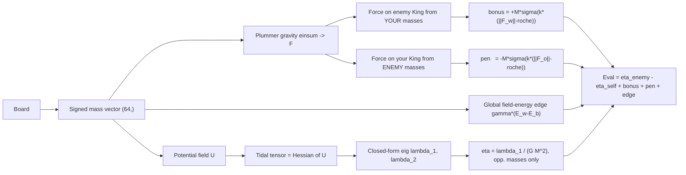

# Kepler-64


An astrophysical chess engine. Its evaluation is a differentiable [JAX](https://github.com/google/jax) N-body gravitational simulation — pieces are masses, and the King loses by tidal disruption past a learned Roche limit instead of by checkmate. It plays valid chess.


> "I'd rather build something that breaks beautifully than something that stays safely ordinary."
> — R.B.


Feynman once said that figuring out physics is like watching a game of chess without knowing the rules. You observe the board long enough, patterns emerge, and eventually you start to guess at the laws underneath.

> "Imagine that the gods are playing some great game like chess... and you don't know the rules of the game, but you're allowed to look at the board... and from these observations you try to figure out what the rules are."
> — Richard Feynman (1981) · [](https://youtu.be/o1dgrvlWML4)

Kepler-64 reverses that completely. It already knows the rules. It's the universe that has to figure out how to play.

This isn't physics as a metaphor for chess. It's the literal equations of astrophysics, handed the rules of chess, and asked to get good at it.

---

## The idea

The question that started this was simple enough to be stupid: *what if a chess position were evaluated by gravity?*

Not gravity as a mood. Not "this piece exerts influence over that square." Plummer-softened Newtonian gravity on a 64-square lattice. Tidal tensors computed from the Hessian of the potential field. A Verlet rollout to project whether the King's formation will hold. The gravitational constant $G$ isn't chosen by hand — it's learned via gradient descent from real game outcomes. The whole pipeline is differentiable.

Every engine since the 1970s has evaluated positions with hand-tuned heuristics — piece-square tables, mobility scores, king safety patterns. Even neural engines like Leela replace heuristics with a black-box network. This replaces heuristics with physics. Not an approximation of physics. Physics.

The result is an engine that doesn't know any chess rules. It discovers positional principles through orbital mechanics.

---

## How the evaluation works

### The board as an N-body system

Each square is a point in 2D space. Occupied squares carry mass — pawn 1, knight 3, bishop 3, rook 5, queen 9, king 1000. The gravitational acceleration at every square is Plummer-softened Newtonian gravity:

$$F_i = G \sum_j \frac{m_j \, (r_i - r_j)}{\left( |r_i - r_j|^2 + \varepsilon^2 \right)^{3/2}}$$

The $(64, 64)$ pairwise distance matrix is static — the board geometry never changes, only the masses do. The entire force field is one `einsum` over a $(64,)$ mass vector. No Python loops in the hot path.

### In matrix form

Let $\mathbf{m}\in\mathbb{R}^{64}$ be the signed mass vector and $\mathbf{R}\in\mathbb{R}^{64\times 2}$ the fixed square coordinates. The softened, $c$-gated interaction is a matrix $\mathbf{K}(c)$ built once from the static distance matrix, so the force field is simply

$$\mathbf{F} = G\,\mathbf{K}(c)\,\mathbf{m}, \qquad \mathbf{F}\in\mathbb{R}^{64\times 2},$$

and the tidal tensor at the King is the $2\times2$ Hessian $\mathbf{A}=\nabla\nabla U$ — a real symmetric matrix whose largest eigenvalue $\lambda_1$ drives the disruption.

### Tidal disruption as the win condition

The tidal tensor is the Hessian of the gravitational potential at the King's square. For a 2×2 matrix this has a closed-form eigenvalue decomposition — no LAPACK, about 10 FLOPs:

$$\lambda = \frac{\text{tr}(A)}{2} \pm \sqrt{\left(\frac{\text{tr}(A)}{2}\right)^2 - \det(A)}$$

The largest eigenvalue $\lambda_1$ is the principal stretching rate — the axis along which the King's defensive structure is being pulled apart. The dimensionless tidal-disruption parameter is:

$$\eta = \frac{\lambda_1 \cdot R_g^3}{G \cdot M_{\text{king}}^2}$$

This recovers the Hill/Roche scaling from first principles on the board. When $\eta$ exceeds a learned critical threshold, the King's position structurally collapses. The engine tracks $d\eta/dt$ across a short Verlet rollout — an increasing tidal stress is the precursor to failure.

### Source-attributed disruption (and a field-energy edge)

A boolean `is_checkmate()` check has zero gradient, so it can't feed the learned-$G$ hook. The tactical term instead uses a smooth, differentiable sigmoid on the gravitational force magnitude — but crucially it is **source-attributed**: only your masses stress the *enemy* King, and only the enemy's masses stress *your* King. Capturing an enemy piece therefore removes the mass that was disrupting *their* King and adds the mass that disrupts *yours* — exactly the trade-off a chess player feels, recovered from physics rather than from a material table.

$$\text{bonus} = +M \cdot \sigma\!\left( k \cdot \bigl(\|F_{\text{opp.King}}\| - \text{roche}\bigr) \right), \qquad
\text{pen} = -M \cdot \sigma\!\left( k \cdot \bigl(\|F_{\text{own.King}}\| - \text{roche}\bigr) \right)$$

A second, global term is the field-energy edge — the differential gravitational energy of the two armies across the whole board, scaled by a learnable $\gamma$. It rewards mass concentration that bends the potential in your favour:

$$\text{edge} = \gamma \cdot \bigl( E_{\text{white}} - E_{\text{black}} \bigr), \qquad E = \tfrac{1}{2}\sum_{i\neq j} \frac{m_i m_j}{\sqrt{|r_i-r_j|^2+\varepsilon^2}}$$

All of it is smooth and end-to-end differentiable, in the same force language as the rest of the physics.

### Learned constants

The physical constants of this chess universe — $G$, the Plummer softening $\varepsilon$, the speed of light $c$, the Roche threshold, plus the disruption scales $k$ (the gain on each tidal sigmoid) and the field-energy weight $\gamma$ — are all leaves that `jax.grad` moves. A logistic loss on game outcomes, optionally with a policy term that ranks the expert's move above the alternatives, backpropagates through the entire pipeline (Plummer → tidal tensor → eigenvalues → $\eta$) into the constants themselves.

The speed of light $c$ carries a monotonicity prior so gradient descent can't collapse the retardation story by pushing $c \to \infty$:

$$\text{prior}(c) = -\lambda_{\text{fast}} \cdot \max(0,\; 2 - c) \;-\; \lambda_{\text{slow}} \cdot \max(0,\; c - 10)$$

Sweet spot is around $c \approx 3\text{–}6$ squares per ply, giving 1–3 ply delays for cross-board threats.

### Verlet rollout

For each candidate move, a short Leapfrog (Verlet) integration projects the King's continuous coordinate forward under the local tidal force. Symplectic integrators conserve energy, so the projection of whether the King crosses its Roche threshold a few plies out is honest — without needing deep minimax search.

---

## The evaluation pipeline



---

## The 218-pad trick

Chess has a theoretical maximum of 218 legal moves in any position. Every batch of candidate moves is statically padded to exactly 218, with zero-mass dummy pieces filling the unused slots. XLA traces the $(218, 64, 2)$ shape exactly once, giving a single `vmap` evaluation sweep.

The sub-millisecond claim refers to this XLA-compiled kernel. The surrounding move generation is now a pure-NumPy board (`kepler64/core/fastboard.py`), verified against python-chess, so the search hot path no longer crosses into python-chess at all.

---

## when the physics gets strange

Layer 1 replaced the heuristic with gravity. Layer 2 does something different: the evaluation function itself becomes physical.

### The Multiverse

The engine evaluates each candidate move under a *distribution* of physical constants sampled from a learned posterior, not under a single fixed set. The combination is a Bayesian model average:

$$\text{Eval}(m) = \sum_i p(\theta_i) \cdot \text{Eval}(m;\; \theta_i), \qquad \theta_i \sim \text{posterior}(G, \varepsilon, c)$$

A move that's robust across many possible universes gets boosted. One that's catastrophic in some gets downweighted. The retarded potential — gravitational influence propagating at finite $c$ — means a Queen sacrifice doesn't register as a threat until the gravity wave arrives several plies later. The engine doesn't know which universe's $c$ governs that delay.

### The Observer

After choosing a move, the engine updates its posterior over $(G, c)$ — the act of playing informs the engine about which physics it inhabits. The update is KL-anchored so it can't drift into nonsensical constants. The opening is played under one set of physical laws; the endgame under slightly different ones.

### Accretion

Captured pieces don't disappear. Their mass is absorbed by the capturing piece:

$$m_{\text{new}} = m_{\text{captor}} + \eta \cdot m_{\text{captured}}$$

The capturing piece grows heavier but also more extended — its radius of gyration increases, which raises its tidal eigenvalue. A Queen that captures three minor pieces becomes a supermassive but structurally fragile object. A single enemy pawn nearby can trigger tidal disruption of the overextended piece.

### Lorentz mass

Repeated movement of the same piece inflates its relativistic mass. To avoid the $v > c$ singularity, velocity is remapped:

$$u = \frac{v}{v + c}, \qquad \gamma = \frac{1}{\sqrt{1 - u^2}}$$

The result: piece shuffling has a real cost. Moving the same piece every opening turn inflates its mass, warping the local tidal tensor and destabilizing nearby friendly pieces. Lorentz mass is the piece's *own* mass; accretion mass is *stolen* mass. They combine.

### Image-seeded universe

The physical constants can be derived from a photograph. The raw bytes are reshaped, FFT'd, and the magnitude spectrum maps to initial values of $[G, \varepsilon, \text{roche}, c]$. An 8×8 crop maps pixel intensity to initial piece masses. The SHA-256 hash of the file provides deterministic seeding. The fundamental constants of the chess universe are, literally, the spectral content of one image.

---

## Does it work?

Yes. Every move it returns is legal. Games terminate by real rules. It will checkmate a careless opponent.

It is not Stockfish. It was never trying to be. It's a differentiable physics simulation that happens to obey chess rules — it doesn't understand chess theory, it understands orbital mechanics and structural collapse, and from those it discovers something that looks a lot like positional thinking.

Look at how it checkmates. It doesn't sacrifice. It doesn't calculate mating nets. It brings the heavy pieces — queens, rooks — towards the enemy King, concentrating mass until the tidal force at that square exceeds the Roche limit and the position structurally collapses.

That's literally what tidal disruption means in this engine. And it's also exactly how humans played chess before modern engines rewired our intuition about the game.

Before Stockfish. Before hypermodern theory. Before anyone showed us that a pawn sacrifice on move 12 can win an endgame 40 moves later. When chess was played the way it *felt* — build mass, apply pressure, the King gets crushed under the weight of everything pointed at it.

The engine doesn't know any of that. It knows gravity. And gravity told it the same thing. Because that's just how concentrated force works — it collapses things. The physics didn't learn this from a chess book. It derived it from first principles. And it turns out the first principles and the pre-computer chess intuition were saying the same thing all along.

It's still being trained: physical constants are learned from real games via a UCI harness against Maia, Stockfish at scaled skill levels, and other engines. We're actively making it stronger without faking the physics. The absurdity is the point, not a limitation. It works. It just plays its own kind of chess.

---

## Usage

```bash
pip install -e ".[dev]"
```

**Requirements:** Python 3.10+, JAX (CPU or GPU), python-chess, matplotlib.

```python
import chess
from kepler64 import RocheEngine, Board

engine = RocheEngine()
board  = Board.from_chess(chess.Board())

score = engine.evaluate(board)       # positive = good for side to move
move  = engine.play(board, depth=2)  # alpha-beta + 218-pad vmap sweep
```

Image-seeded universe:

```python
engine = RocheEngine(seed_image="1000113151.jpg")
```

Generate a visualisation GIF:

```python
from kepler64.viz.glassbox import game_gif
game_gif(engine, out_path="kepler64.gif", max_ply=30)
```

---

## Project structure

```
kepler64/
├── __init__.py            # RocheEngine
├── core/
│   ├── board.py           # board state + signed mass vector (python-chess adapter)
│   ├── fastboard.py       # pure-NumPy board + legal move gen (verified vs python-chess)
│   ├── constants.py       # G, ε, c, roche, k, γ — learnable leaves + c-prior
│   ├── gravity.py         # static (64,64) distance matrix + Plummer einsum
│   ├── tidal.py           # Hessian, closed-form 2×2 eig, η
│   ├── verlet.py          # symplectic Leapfrog rollout
│   ├── lorentz.py         # relativistic mass escalation
│   ├── evaluate.py        # source-attributed disruption + field-energy edge
│   └── image_seed.py      # image FFT → constants + initial masses
├── multiverse/            # Layer 2 (see "when the physics gets strange")
│   ├── posterior.py       # Bayesian average over (G, ε, c)
│   ├── observer.py        # in-game KL-anchored posterior update
│   ├── accretion.py       # captured mass absorbed, not deleted
│   └── fluid.py           # variance-field Stokes flow
├── search/
│   ├── minimax.py         # alpha-beta + batched quiescence + 218-pad vmap sweep
│   └── openings.py        # quasi-equilibrium opening book
├── match/
│   └── uci_harness.py     # UCI engine matches + Elo estimate
├── training/
│   ├── data.py            # game → (mass_vector, outcome) samples
│   ├── data_uci.py        # Stockfish-skill self-play → expert-move policy batches
│   ├── loss.py            # logistic outcome + expert-move policy + c-prior
│   ├── train.py           # jax.grad through the physics engine
│   └── ablation.py        # G learned vs G=1 comparison
├── viz/
│   └── glassbox.py        # potential heatmap + quiver + line of failure
├── bench/
│   ├── sweep_time.py      # 218-move evaluation sweep benchmark
│   └── elo_ladder.py      # BayesElo internal rating pool
└── tests/
    ├── test_gravity.py    # force field correctness
    ├── test_tidal.py      # closed-form eig vs scipy
    └── test_board.py      # board roundtrip vs python-chess
```

---

## Testing

```bash
pytest kepler64/tests/ -v
```

---

All my loves in one project: chess, space, maths, physics — and the stubborn refusal to do the sensible thing. There was a question I couldn't leave alone: *what if gravity played chess?* Turns out it was more serious than it sounded.

There's a quote on my portfolio page — something I wrote a while ago, not thinking about any of this. I didn't write it for Kepler-64. But then I built an engine where the King loses by tidal disruption, where a Queen can become so massive from captures that a single pawn tears it apart, where the gravitational constant of the chess universe is literally learned from real games — and I thought, well. Looks like I meant it the whole time.

If it makes you smile and then makes you think, it's doing exactly what it was built to do.

---

## License

MIT
