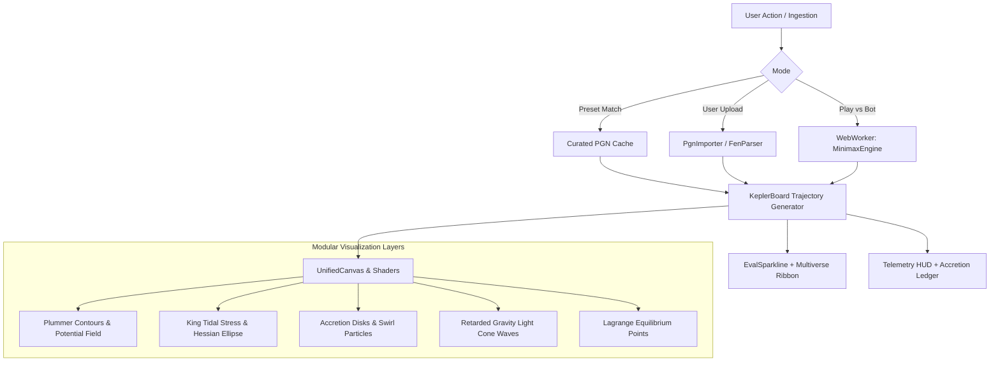

# Kepler-64: Advanced Astrophysical Features & Visualizers Roadmap

> **Document Status:** Architectural Specification & Implementation Context  
> **Target Environment:** Client-Side Web Observatory (`viz-web`) on GitHub Pages  
> **Core Objective:** Catalog future gameplay modes, data ingestion pipelines, and astrophysical visualization layers to expand Kepler-64 from a curated match viewer into an interactive astrophysical chess laboratory.

---

## 📑 Table of Contents
1. [Architectural Philosophy](#1-architectural-philosophy)
2. [Interactive Gameplay & Data Ingestion](#2-interactive-gameplay--data-ingestion)
   - [2.1 Play Against Kepler-64 (Interactive Bot Mode)](#21-play-against-kepler-64-interactive-bot-mode)
   - [2.2 PGN / FEN Ingestion & Custom Match Analyzer](#22-pgn--fen-ingestion--custom-match-analyzer)
3. [Deep Astrophysical Visualizers (Layer 2 & Theoretical Mechanics)](#3-deep-astrophysical-visualizers-layer-2--theoretical-mechanics)
   - [3.1 Multiverse Uncertainty Ribbon (Bayesian Universe Sampling)](#31-multiverse-uncertainty-ribbon-bayesian-universe-sampling)
   - [3.2 Accretion Disks & Supermassive Entity Halos (Black Hole Pieces)](#32-accretion-disks--supermassive-entity-halos-black-hole-pieces)
   - [3.3 Retarded Gravitational Wavefronts (Finite Speed of Light $c$)](#33-retarded-gravitational-wavefronts-finite-speed-of-light-c)
   - [3.4 Relativistic Lorentz Escalation & Kinetic Acceleration Trails](#34-relativistic-lorentz-escalation--kinetic-acceleration-trails)
   - [3.5 Lagrange Equilibrium Points ($L_1$–$L_5$) & Metric Frame Dragging](#35-lagrange-equilibrium-points-l_1l_5--metric-frame-dragging)
4. [Client-Side Implementation Blueprint (Zero Server Architecture)](#4-client-side-implementation-blueprint-zero-server-architecture)
5. [Presentation & Communication Playbook (Hackathons & Demonstrations)](#5-presentation--communication-playbook-hackathons--demonstrations)

---

## 1. Architectural Philosophy

All future expansions documented here adhere to three strict principles:
1. **Zero-Backend Client Execution:** Everything runs 100% inside the user's browser using TypeScript, Web Workers, and HTML5 Canvas/SVG, maintaining seamless static hosting on **GitHub Pages**.
2. **Mathematical Authenticity:** Visualizers are not aesthetic skins or random noise. Every graphic, glow, and curve directly reflects closed-form or simulated physics from General Relativity, Newtonian dynamics, and tensor calculus.
3. **Non-Intrusive Layer Modularization:** New visualizers must live as toggleable layers (`[✦ Accretion]`, `[≈ Multiverse]`, `[◎ Light Wave]`) so the core chessboard remains crisp and uncluttered by default.

---

## 2. Interactive Gameplay & Data Ingestion

### 2.1 Play Against Kepler-64 (Interactive Bot Mode)
* **Problem:** Users currently observe pre-recorded matches. They cannot test their own tactical skill against gravitational evaluation directly on the web.
* **Proposed Feature:** A live `[🎮 Play vs Kepler]` interactive match mode.
* **How It Works:**
  1. The user picks their side (White or Black) and an engine persona:
     - *Newtonian Classicist:* High gravitational constant $G$, tight Roche radius $\rho$. Focuses on brute mass accumulation.
     - *Relativistic Attacker:* Fast speed of light $c$, high accretion factor $\eta_{\text{acc}}$. Aggressively feeds Queen captures to create supermassive black holes.
     - *Quantum Multiverse Bot:* Samples 5 alternate universes on each move and picks the minimax line with the lowest Bayesian risk.
  2. **Search Mechanism:** A lightweight 2-to-3 ply Alpha-Beta / Minimax search implemented in a Web Worker:
     - Generates legal moves with `chess.js`.
     - Scores leaf nodes using `evaluatePosition(board, config)`.
     - Returns best move with its principal continuation and predicted tidal disruption trajectory.
  3. **Interactive Reaction:** As the user drags and hovers their piece, the potential field warps live under their cursor before dropping.

---

### 2.2 PGN / FEN Ingestion & Custom Match Analyzer
* **Problem:** Players cannot analyze their own games played on Chess.com, Lichess, or tournaments.
* **Proposed Feature:** An `[📂 Import Game]` modal supporting raw PGN text, `.pgn` file uploads, and arbitrary FEN strings.
* **How It Works:**
  1. User pastes a PGN or drops a `.pgn` file into an import dialog.
  2. `chess.js` parses the move list, sanitizes headers (players, event, date), and validates legality.
  3. The engine performs an automated sub-second batch sweep:
     - Iterates through every ply $(0 \dots N)$.
     - Evaluates gravitational potential, tidal stresses, and King Roche index $\eta$ for both colors.
     - Automatically generates a complete **Panoramic Trajectory Horizon**.
  4. The user can scrub through their own game, finding the exact ply where their opponent's King underwent catastrophic tidal collapse.

---

## 3. Deep Astrophysical Visualizers (Layer 2 & Theoretical Mechanics)

### 3.1 Multiverse Uncertainty Ribbon (Bayesian Universe Sampling)
* **Theoretical Foundation:** In Layer 2, candidate moves are evaluated not on a single fixed set of constants, but across a learned posterior distribution over the 13-leaf parameter space:
  $$\theta = (G, \varepsilon, c, \rho_{\text{roche}}, R_g, \dots) \sim \mathcal{N}(\mu_\theta, \Sigma_\theta)$$
  A move that is solid across diverse physical universes is awarded high robustness; a move that collapses if $G$ shifts slightly is heavily penalized.
* **Visualization Design:**
  - **Trajectory Timeline:** Render a **translucent, glowing confidence envelope** (like a Monte Carlo band) around the main trajectory line. The width of the ribbon indicates physical volatility.
  - **Multiverse Spaghetti Lines:** Toggleable 5 thin colored curves showing individual evaluation paths across 5 sampled universes (e.g., *Universe $\alpha$: High Mass*, *Universe $\beta$: Fast Light*, *Universe $\gamma$: Soft Potential*).
  - **HUD Telemetry Metric:** Display `Multiverse Volatility: ±0.42 native (σ = 0.18)`.

---

### 3.2 Accretion Disks & Supermassive Entity Halos (Black Hole Pieces)
* **Theoretical Foundation:** Captured pieces do not vanish into the void. Their physical mass is consumed by the capturing piece via mass accretion:
  $$m_{\text{captor}}^{\text{new}} = m_{\text{captor}} + \eta_{\text{accretion}} \cdot m_{\text{victim}} \quad (\eta_{\text{accretion}} \approx 0.80)$$
  A Queen ($m=9$) that captures two Rooks ($m=5 \times 2$) absorbs $+8.0\text{m}$, reaching $m=17.0\text{m}$—nearly doubling its gravitational spacetime well.
* **Visualization Design:**
  - **Pulsing Accretion Halos:** Draw an orbital accretion disk around any piece whose mass exceeds its native baseline. The halo's radius $R_{\text{halo}}$ scales with $\sqrt{m - m_{\text{base}}}$.
  - **Matter Stream Animation:** When a capture happens, render a quick 300ms glowing particle spiral flowing from the captured square into the captor.
  - **Accretion Inventory Panel:** A mini HUD list showing top heavy entities on the board:
    - `♛ d4 [17.0m] · Consumed: ♜, ♜ (+8.0m)`
    - `♞ f3 [5.4m] · Consumed: ♟, ♟ (+2.4m)`

---

### 3.3 Retarded Gravitational Wavefronts (Finite Speed of Light $c$)
* **Theoretical Foundation:** Gravity does not act instantaneously at infinite distance; changes in mass distribution propagate outward at a finite speed of light $c \in [1, 10]$ squares per ply. 
  A Queen moved on $a1$ does not instantly exert full force on the King on $h8$—the field update arrives over subsequent plies with retarded time delay $\Delta t = \Delta r / c$.
* **Visualization Design:**
  - **Expanding Light Cone Ripple:** When a piece moves, render a subtle concentric circular ripple expanding outward from the origin square across plies at speed $c$.
  - **Horizon Indicator:** Squares outside the current light cone are rendered with a faint dashed boundary indicating they have not yet felt the updated gravitational wave.

---

### 3.4 Relativistic Lorentz Escalation & Kinetic Acceleration Trails
* **Theoretical Foundation:** When heavy pieces execute long-range, high-velocity traverses (e.g., a Rook sweeping 7 squares along an open file or a Queen diagonal sprint), their effective dynamical mass inflates via Lorentz scaling:
  $$m_{\text{eff}} = \gamma(v) \cdot m = \frac{m}{\sqrt{1 - (v/c)^2}}$$
* **Visualization Design:**
  - **Kinetic Vector Trails:** Render motion blur/streamlines along the trajectory vector of high-velocity moves.
  - **Relativistic Glow:** The piece pulses briefly in electric cyan when moving at relativistic speed fractions ($v/c > 0.6$).

---

### 3.5 Lagrange Equilibrium Points ($L_1$–$L_5$) & Metric Frame Dragging
* **Theoretical Foundation:** The two-body gravitational field between the White King ($M_1=1000\text{m}$) and Black King ($M_2=1000\text{m}$) generates 5 classical Lagrange equilibrium points where net gravitational forces cancel out or form stable orbital pockets.
* **Visualization Design:**
  - **Lagrange Markers:** Render subtle glowing crosshairs on squares corresponding to $L_1$ (unstable saddle between kings), $L_4$, and $L_5$ (equilateral balance points).
  - **Tactical Outposts:** If a Knight or Bishop occupies a Lagrange point, highlight it as a "Gravitational Anchor" requiring zero kinetic energy to maintain position.

---

## 4. Client-Side Implementation Blueprint (Zero Server Architecture)

### Proposed Source File Breakdown:
- `viz-web/src/core/multiverse.ts` — Samples $K$ alternate universe configs $(\theta_1 \dots \theta_K)$ and computes mean score $\mu$ and standard deviation $\sigma$.
- `viz-web/src/core/accretion.ts` — Tracks piece capture history and dynamic mass accumulation vectors.
- `viz-web/src/core/searchWorker.ts` — Web Worker running 2-3 ply Alpha-Beta search for interactive play without UI frame drops.
- `viz-web/src/ui/PgnImportModal.ts` — Modal interface for pasting PGN/FEN strings or dragging files.
- `viz-web/src/render/AccretionRenderer.ts` — Specialized canvas renderer for pulsing mass halos and particle accretion streams.

---

## 5. Presentation & Communication Playbook (Hackathons & Demonstrations)

When demonstrating or explaining these advanced features to judges, streamers, or developer communities:

1. **The Core Hook:**  
   *"We didn't just skin a chessboard—we simulated the actual discrete astrophysics. When pieces eat each other, they gain mass like black holes; when the King dies, it literally gets torn apart by gravitational tidal forces past the Roche limit."*
2. **The "Play vs Bot" Demo Pitch:**  
   *"You aren't playing against an algorithm trained on opening books. You are playing against an N-body gravitational field that thinks your King is an unstable planetary moon."*
3. **The Multiverse Demo Pitch:**  
   *"Watch this uncertainty ribbon—when Kasparov plays an aggressive sacrifice, the evaluation diverges across alternate universes because the position depends heavily on the exact gravitational constant of that universe."*
4. **The Zero-Server Technical Flex:**  
   *"All of this—the continuous Plummer potential fields, $2\times2$ Hessian eigensolvers, and multi-ply gravitational search—runs at 60 FPS purely inside your browser on GitHub Pages."*
